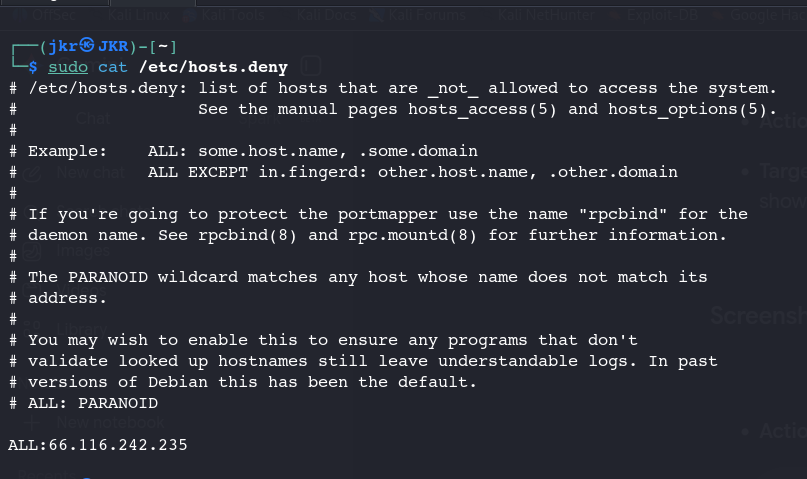
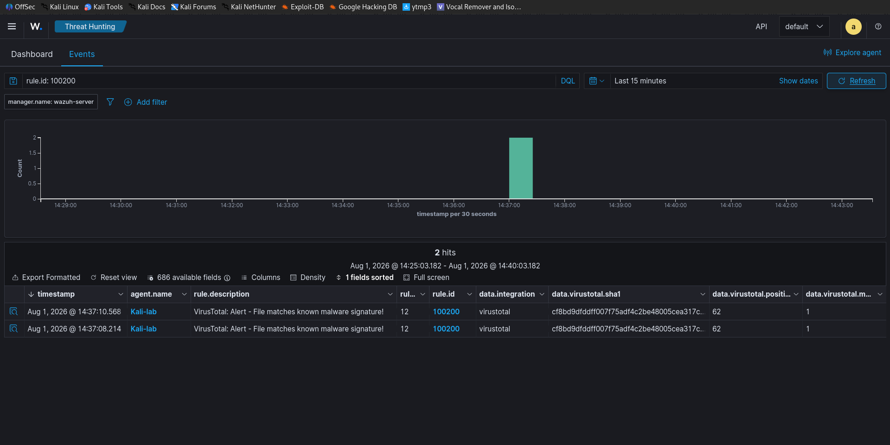

# VIPER-SOC : Threat Detection, Intelligence & Incident Response

## 1. Executive Summary 📋

Project VIPER (Vulnerable IP & Payload Eradication Response) is an automated, dual-layer incident response framework integrated directly with Wazuh SIEM. It bridges real-time threat intelligence feeds with endpoint containment mechanisms blocking malicious network actors and purging infected files automatically without human intervention.

---

## 2. Architecture Setup 📌

* **Network Defense Setup:** Configured Wazuh Manager with a custom Python integration script (`integrator`) targeting the AbuseIPDB API. On the agent side, an Active Response executable triggers on Rule ID matches (Level 10) to automatically append the offending IP address to /etc/hosts.deny.
* **Endpoint File Defense Setup:** Enabled Wazuh File Integrity Monitoring (syscheck) on target directories to calculate SHA256 hashes upon file creation or modification. Configured the VirusTotal integration module on the manager to query file hashes and execute a custom Active Response cleanup script (rm -f) on the agent upon a positive malware match (Level 12).

*Figure 1: Automated IP block appended to /etc/hosts.deny upon high AbuseIPDB confidence detection.*

## 3. Core Capabilities & Defense Modules 🛡️

### Module 1: Network Defense (AbuseIPDB Integration)
* **Monitored Vector:** Inbound and outbound IP connections captured by system logs.
* **Threat Intelligence:** Queries the AbuseIPDB API in real time to fetch IP reputation metrics.
* **Trigger Condition:** Confidence score exceeds 50%.
* **Automated Remediation:** Generates a Level 10 Alert on the manager and automatically appends the offending IP to /etc/hosts.deny on the target agent.

### Module 2: Endpoint File Defense (VirusTotal Integration)

* **Monitored Vector:** Real-time File Integrity Monitoring (FIM) tracking file creation or modification.
* **Threat Intelligence:** Queries the VirusTotal API using the calculated SHA256 file hash.
* **Trigger Condition:** File flagged as positive/malicious by threat engines.
* **Automated Remediation:** Generates a Level 12 Alert on the manager and executes a silent deletion (rm -f) of the malicious payload on the endpoint.

---

## 4. Operational Workflow 🔄

* **Step 1 — Detection:** Agent captures an event (network connection or new file creation) and sends telemetry to the Wazuh Manager.
* **Step 2 — Enrichment:** Wazuh Manager routes the IP or SHA256 hash through custom integration hooks to external APIs (AbuseIPDB / VirusTotal).
* **Step 3 — Rule Evaluation:** Wazuh rules check if the returning score exceeds defined severity thresholds.
* **Step 4 — Active Response:** Upon rule match, the manager instructs the local agent active-response engine to execute immediate containment (IP ban or file deletion).

*Figure 2: Wazuh SIEM triggering Level 12 alert enriched with VirusTotal threat intelligence.*

---

## 5. Key Benefits 🌟

* **Zero-Touch Containment:** Reduces Mean Time to Respond (MTTR) from minutes to milliseconds by removing manual analyst triage steps.
* **Dual-Domain Coverage:** Secures both the network boundary (incoming/outgoing traffic) and the local host filesystem.
* **False Positive Reduction:** Utilizes strict confidence thresholds (e.g., AbuseIPDB score > 50%) to ensure benign traffic isn't accidentally disrupted.

---

## 6. Prerequisites & Technical Requirements 🛠️

* **SIEM Infrastructure:** Active Wazuh Manager and at least one connected Linux Wazuh Agent.
* **API Access:** Valid API keys for both AbuseIPDB and VirusTotal.
* **Supported Operating System:** Linux (Debian/Ubuntu or RHEL-based distributions).

---

**Author:** Adithyan V
